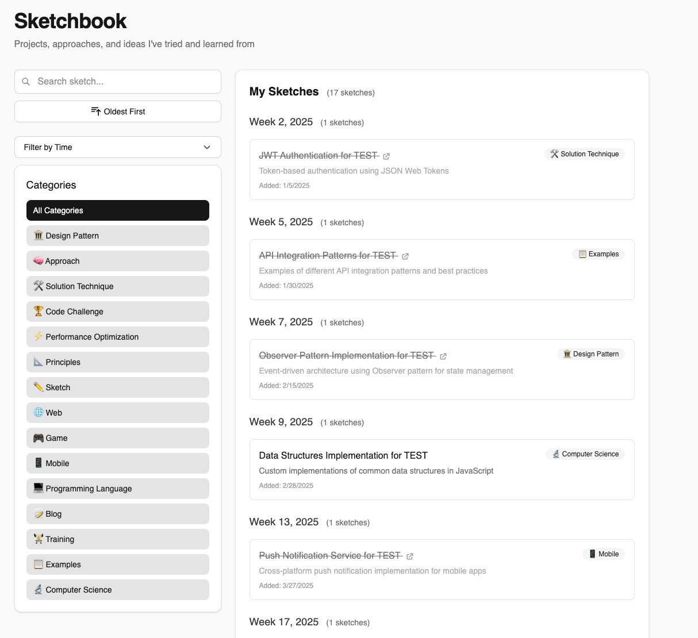

# Sketchbook

This repository serves as a collection of my sketches, and explorations across various technical domains. You can find these materials on the accompanying [website](https://sketchbook.cihat.dev/). 

<!-- ## Resources
[My Bookmarks](https://cihat.dev/bookmarks) |
[Roadmap](https://roadmap.sh/) | 
[Awesome](https://github.com/sindresorhus/awesome) |
[Substack](https://substack.com/) |
[Dev.to](https://dev.to/) |
[Medium](https://medium.com/) |

## Categories
Design Patterns, Solution Techniques, System Design, Microservices, Performance Optimization, Principles, Programming Languages, Code Challenges, Data Structures, Algorithms, Testing, DevOps, Web Development, Game Development, Mobile Development, Cloud Computing, Blockchain, WebAssembly, Machine Learning, Artificial Intelligence, Data Science, Big Data, Computer Science, Databases, Security, Containers, CI/CD, Serverless, Blogging, Training, Examples, Sketches, Approach

Each category will be continuously updated with new content, examples, and insights as I explore and learn more about these topics. -->
